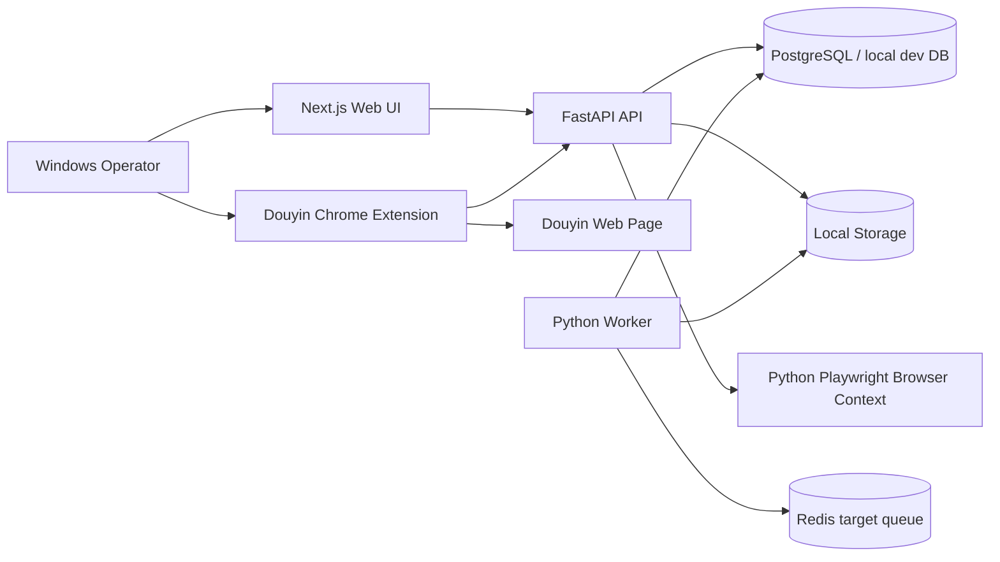

# Architecture Map

## Detected Tech Stack

- Monorepo/package manager: npm workspaces, `package-lock.json`, npm declared as `npm@11.11.0`.
- Frontend: Next.js 15, React 19, TypeScript, App Router under `apps/web/src/app`.
- API/backend: Python 3.12, FastAPI, Pydantic Settings, SQLAlchemy 2, Alembic, psycopg.
- Worker: Python local polling worker skeleton, SQLAlchemy/psycopg/Redis dependencies.
- Browser automation/crawling support: Python Playwright in API.
- Extension: TypeScript Chrome extension under `apps/extension-douyin-capture`, built with `tsc` and `esbuild`.
- Database target: PostgreSQL in Docker; local files indicate SQLite-like/local data also exists under `apps/api/data`.
- Queue target: Redis in Docker; current worker is local polling with mock handlers and optional Redis URL.
- Video/AI pipeline foundations: API modules for audio analysis, TTS, subtitles, render prep/render, risk, publishing; no real full video editing pipeline verified in this audit.
- Docker: `docker-compose.yml` defines postgres, redis, api, worker, web.

## Folder Structure Overview

```text
apps/
  web/                         Next.js operator UI
  api/                         FastAPI API, models, migrations, services, tests
  worker/                      Python background worker skeleton
  extension-douyin-capture/    Chrome extension for Douyin capture/whole-profile harvest
packages/
  shared/                      shared package placeholder/docs
  config/                      config conventions/docs
docs/                          extensive architecture, runbooks, phase logs, release notes
scripts/                       Windows PowerShell dev scripts
```

## Runtime Entry Points

- Root scripts: `package.json` -> `npm run dev`, `npm run doctor`, `npm run db:migrate`, `npm run smoke`.
- Local dev start: `scripts/dev-start.ps1` starts:
  - API: `uvicorn src.main:app --reload` in `apps/api`
  - Web: `npm run dev` in `apps/web`
  - Worker: `python src/main.py` in `apps/worker`
- API app: `apps/api/src/main.py` creates FastAPI and includes routers.
- Web app: `apps/web/src/app/layout.tsx`, `apps/web/src/app/page.tsx`, route pages under `apps/web/src/app`.
- Worker: `apps/worker/src/main.py` instantiates `LocalPollingWorker`.
- Extension: `apps/extension-douyin-capture/public/manifest.json`, `src/background.ts`, `src/contentScript.ts`, `src/popup.ts`.

## Backend/API Map

Important routers included in `apps/api/src/main.py`:

- Auth: `/auth/*`
- Source ingest: `/source-profiles/ingest`, `/crawl-sessions`, `/source-profiles`, `/source-profiles/{id}/videos`
- Douyin extension: `/douyin-extension/*`
- Capture inbox: `/capture-inbox/*` and `/douyin-extension/capture-sessions/{id}/items`
- Douyin accounts/browser connect: `/douyin-accounts/*`
- Candidates/review board, jobs, downloads, audio, TTS, renders, risk, publish, reup queue, export handoff, analytics, operations.

## Database Map

Core profile/video import models are in `apps/api/src/models/ingestion.py`:

- `SourceProfile` -> `source_profiles`
- `CrawlSession` -> `crawl_sessions`
- `SourceVideo` -> `source_videos`
- `VideoMetricSnapshot` -> `video_metric_snapshots`

Capture inbox models are separate and used by the extension flow. Migrations show broad schema evolution through `apps/api/alembic/versions/0025_capture_inbox_intake_columns.py`.

## Docker Map

`docker-compose.yml` defines:

- `postgres`: PostgreSQL 16, internal network only.
- `redis`: Redis 7, internal network only.
- `api`: FastAPI image, exposes 8000 internally, requires JWT/CORS/Douyin encryption env in production.
- `worker`: Python worker image, shares API storage volume.
- `web`: Next.js image, publishes `${WEB_PORT:-3000}:3000`, proxies upstream to `api:8000`.

## Mermaid Diagram



## Important Documentation Read

- `README.md`: states local-first SaaS-ready direction, app/package responsibilities, Phase 1 product scope, local commands.
- `AGENTS.md`: repository boundaries, no secrets, no long work in API handlers, testing/docs expectations.
- `docs/architecture-overview.md`: confirms Next.js/FastAPI/Python worker/PostgreSQL/Redis/local storage architecture and current alpha foundation.
- `docs/browser-connect-local-setup.md`: states Douyin browser-assisted connect uses Python Playwright in API and requires `python -m playwright install chromium`.
